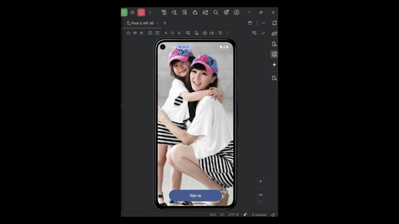

cat << 'EOF' > README.md
# ✨ Ứng dụng Demo Onboarding với Jetpack Compose

Ứng dụng mobile demo khả năng tạo **hiệu ứng onboarding phức tạp** với **Jetpack Compose**, phù hợp cho các ứng dụng yêu cầu trải nghiệm người dùng **cao cấp** và **mượt mà**.  

---

## 🛠️ Công nghệ sử dụng
- **Jetpack Compose** – xây dựng UI hiện đại cho Android  
- **Animatable** – điều khiển animation mượt mà và chi tiết  
- **detectDragGestures** – xử lý thao tác vuốt của người dùng  
- **graphicsLayer** – hỗ trợ transform phức tạp (scale, rotate, alpha...)  
- **Modifier.pointerInput** – tương tác trực tiếp với input (chạm, kéo, vuốt)  

---

## 🎥 Demo
<p align="center">
  
</p>

---

## 📦 Cài đặt và chạy ứng dụng
- Mở project bằng **Android Studio**  
- Kết nối thiết bị thật hoặc dùng **Android Emulator**  
- Nhấn **Run ▶️** để trải nghiệm ứng dụng  

---

## 🗂️ Cấu trúc code

Dự án được tổ chức theo mô hình **feature-based**, dễ mở rộng và bảo trì:  

```text
app/
├── ui/
│   ├── components/       # Các thành phần UI tái sử dụng (Button, Indicator...)
│   ├── screens/          # Các màn hình (OnboardingScreen, WelcomeScreen...)
│   └── theme/            # Màu sắc, typography, style dùng chung
│
├── navigation/           # Điều hướng giữa các màn hình (NavHost, Routes...)
│
├── model/                # Các model dữ liệu (OnboardingPage, User...)
│
└── MainActivity.kt       # Điểm khởi chạy ứng dụng
